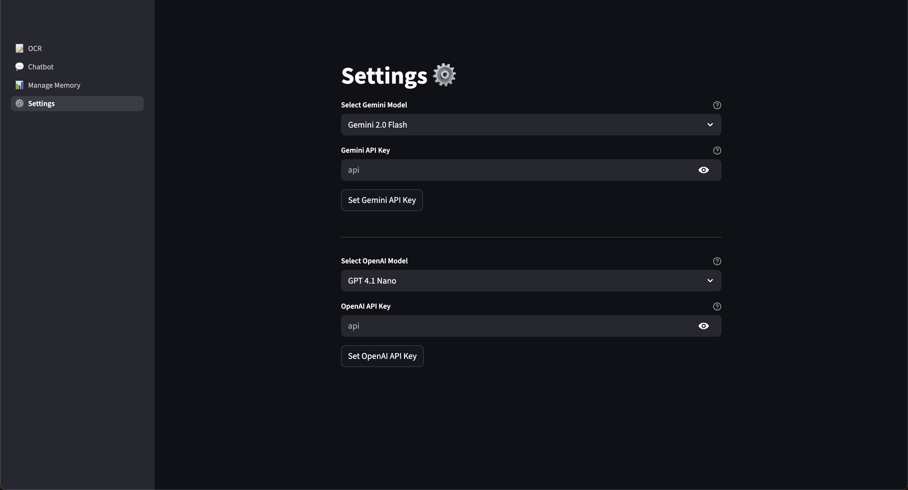
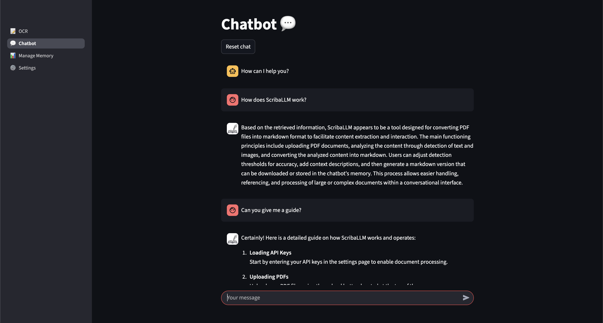

<div align="center">
    
</div>
<br style="line-height: 100px;">

Convert your PDF files into dynamic markdown with the power of Large Language Models.


<!-- @import "[TOC]" {cmd="toc" depthFrom=1 depthTo=2 orderedList=false} -->

<!-- code_chunk_output -->

- [Prerequisites](#prerequisites)
- [Installation](#installation)
- [How to use](#how-to-use)
- [Notes for developers](#notes-for-developers)
- [License](#license)

<!-- /code_chunk_output -->


## Prerequisites
Before getting started, make sure you have the following software packages installed on your system:
- [Docker](https://docs.docker.com/get-started/get-docker/)
- [Docker Compose](https://docs.docker.com/compose/install/)

You will also need [OpenAI](https://platform.openai.com/docs/quickstart) and [Gemini API](https://ai.google.dev/gemini-api/docs/quickstart) keys.

## Installation
1. Open PowerShell (Windows) or Terminal (Linux/macOS) and clone the repository:
   ```zsh
   git clone https://github.com/eliaf2/ScribaLLM.git
   ```
2. Move to the repository:
   ```zsh
   cd path/to/repository
   ```
3. Compile the repository:
    **Linux/macOS (zsh)**
   ```zsh
   zsh run.sh
   ```
   **Windows (PowerShell)**
   ```powershell
    .\run.ps1
    ```
4. Once the containers are running, open your browser and navigate to:
    ```
    http://localhost:8080/
    ```

### Script Options

Both `run.sh` (Linux/macOS) and `run.ps1` (Windows) support the following options:

#### Basic Options

| Option | Description |
|--------|-------------|
| `-dev`, `--dev` (Linux/macOS)<br>`-Dev` (Windows) | Run in development mode |
| `-d`, `--detached` (Linux/macOS)<br>`-Detached` (Windows) | Run containers in detached mode |
| `-h`, `--help` (Linux/macOS)<br>`-Help` (Windows) | Show help message and available options |
| `-v`, `--verbose` (Linux/macOS)<br>`-Verbose` (Windows) | Enable verbose output for debugging |

#### Build Options

| Option | Description |
|--------|-------------|
| `--no-cache` (Linux/macOS)<br>`-NoCache` (Windows) | Build Docker images without using cache |
| `--rebuild` (Linux/macOS)<br>`-Rebuild` (Windows) | Force rebuild of all Docker images |
| `--init` (Linux/macOS)<br>`-Init` (Windows) | Reinitialize containers (remove and recreate) |

## How to use
1. Go to the Settings page and add the API keys:
<div align="left">
    
</div>
2. On the OCR page you can upload your files and convert them to markdown:
<div align="left">
    
</div>
3. On the Chatbot page you can ask the LLM about your notes:
<div align="left">
    
</div>
4. You can manage your saved notes on the Manage Memory page:
<div align="left">
    
</div>

## Notes for developers

If you want to contribute to this project or you are curious of how it works, you can check the *Notes for Developers* [here](documentation.md).

## License
This repository is licensed under the Apache License 2.0. 
You are free to use, modify, and distribute the code, provided that you comply with the terms of the license. 
For more details, refer to the LICENSE file included in this repository.