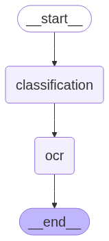

# ScribaLLM - Notes for Developers


<!-- @import "[TOC]" {cmd="toc" depthFrom=2 depthTo=6 orderedList=false} -->

<!-- code_chunk_output -->

- [General description](#general-description)
- [Docker services](#docker-services)
- [OCR](#ocr)
  - [OCR_LLM](#ocr_llm)
- [RAG and Vector Database management](#rag-and-vector-database-management)
  - [ChromaVectorStore](#chromavectorstore)
  - [Manage Memory Page](#manage-memory-page)
- [Chatbot](#chatbot)
  - [Agentic RAG](#agentic-rag)
  - [Interface](#interface)
- [Settings page](#settings-page)
- [Debug page](#debug-page)

<!-- /code_chunk_output -->

## General description
The entrypoint of the software is the `main.py` file, which manages the user interface via the `streamlit` package. After inserting the API keys and selecting the model in the `Settings` page, the user can upload their documents, one at a time, and use the OCR agent to convert the PDF to Markdown. Then, they can interact with the agentic RAG in the `Chatbot` page. The `Manage Memory` page allows to manage the vector database.
If the repository is compiled in *developer mode*, then the `Debug` page shows the log file and the variables in `st.session_state`.

To understand how this software works, it is important to remember that streamlit re-executes the entire script every time the user interacts with an element on the page.

In the following sections, each component of the software will be discussed in detail.

## Docker services
The `run` script builds two docker images:
- `scriballm-api` for the layout detection server.
- `scriballm-frontend` for the streamlit server and AI agent functionalities;

By default, without any flags, the `run` script compiles the `docker-compose.yaml` file, which builds the repository by cloning it from github. 
If the `-dev` flag is invoked, then the `docker-compose.dev.yaml` is compiled and the local repository is built. This sets up the following volumes:
- The `/app` volume within the `frontend` container is mounted with `read-only` permission .
- The `/api` volume within the `api` container is mounted with `read-only` permission.

The `api` container runs a FastAPI server on `localhost:8000`. It provides an interface for the layout detection function, allowing it to communicate with the frontend.
The `frontend` container runs the `streamlit` server on `localhost:8080`.

## OCR
The `ocr.py` script starts with
```python
st.write('# OCR 📝')

st.write('## Upload a PDF file to perform OCR')
uploaded_file = st.file_uploader("Choose a PDF file", type="pdf")
uploaded_file_name = uploaded_file.name if uploaded_file else None
```
which allows to upload a new file. Then, if it is a valid file, the PDF is copied to the following path: `/ScribaLLM/tmp/uploaded_file.pdf` . Using the `pdf2image` library, the `convert_from_bytes` function allows to convert the `PDF` to `jpg` and all the pictures are saved into `/ScribaLLM/tmp/jpg`. Also, the metadata of the pdf, in particular name, dimensions and file_id, are saved in `/ScribaLLM/tmp/metadata.json`. This procedure is performed in order to have a local copy of the uploaded file and prevent it from being removed when the script is run again. Furthermore, this also allows the software to display the last uploaded file when it is run again.

Then, the script calls the layout detection API:
```python
response = call_layout_detection_api(tmp_file, st.session_state.conf)
```
where ```call_layout_detection_api``` is defined in the following way:
```python
@st.cache_resource
def call_layout_detection_api(file: bytes, confidence: float) -> dict | None:
    '''Call the layout detection API.
    '''
    logging.debug("Calling layout detection API")
    response = requests.post(
        "http://api:8000/layout-detection/",
        files={"file": file},
        params={"confidence": confidence}
    )
    if response.status_code == 200:
        return response.json()
    else:
        st.error("Error calling API")
        return None
```
The API is hosted locally and listens on port 8000. When the `call_layout_detection_api` function is invoked, it sends a POST request to the endpoint `http://api:8000/layout-detection/`. If the API responds with a status code of 200, the response is returned as a JSON object. The API is executed on the `api` service, which runs the following code:

```python
from doclayout_yolo import YOLOv10
from PIL import Image

def load_model():
    '''Load the YOLOv10 model for document layout analysis.'''
    return YOLOv10("/models/doclayout_yolo_docstructbench_imgsz1024.pt")

def predict_layout(model: YOLOv10, image: Image.Image, confidence: float):
    ''' Detect the layout of a document using the YOLOv10 model.'''
    results = model.predict(image, imgsz=1024, conf=confidence, device="cpu")[0]
    return results
```

```python
from fastapi import FastAPI, UploadFile, File
from fastapi.responses import JSONResponse
from pdf2image import convert_from_bytes
from model_utils import load_model, predict_layout
from PIL import Image

app = FastAPI()
model = load_model()

@app.post("/layout-detection/")
async def layout_detection(file: UploadFile = File(...), confidence: float = 0.1) -> JSONResponse:
    file_bytes = await file.read()

    images: list[Image.Image] = convert_from_bytes(file_bytes, dpi=300)

    detections = []
    for img in images:
        det_res = predict_layout(model, img, confidence)
        detections.append(det_res.tojson())

    return JSONResponse(content={"results": detections})
```
You can learn more about the `doclayout_yolo` library [here](https://github.com/opendatalab/DocLayout-YOLO).

The API response is a JSON object structured as follows:
```json
{
    "results": [
        {
            "name": "figure",
            "class": 8,
            "confidence": 0.50954,
            "box": {
                "x1": 149.06,
                "y1": 201.92,
                "x2": 1560.45,
                "y2": 328.20
            }
        },
        ...
    ]
}
```

The `name` field represents the detected layout element type and can have one of the following values:
- `abandon`
- `plain text`
- `isolate_formula`
- `formula_caption`
- `figure`
- `figure_caption`
- `table`

The function `filter_detection` filters only results with `name = "figure"`:
```python
response = filter_detection(response["results"], types=['figure']) if response else []
```

The`save_cropped_images` function saves the detected parts in jpg in `/ScribaLLM/tmp/cropped` folder and `plot_cropped_images` displays them. Also the `plot_detection_frames` function plots the detection boxes on the page.

When the `Convert to Text` button is pressed, the `ocr_llm` function is used a wrapper for the initialization and call of a `OCR_LLM` object, which is defined in `utils/llm.py`. How it works will be explained in the [next subsection](#ocr_llm). 
```python
st.session_state.ocr_output, llm = ocr_llm()

for page in st.session_state.ocr_output:
        st.session_state.ocr_output_text_list.append(page[0])
        st.session_state.ocr_output_pictures_list.append(page[1])

    st.session_state.ocr_output_pictures_list = [
        item for sublist in st.session_state.ocr_output_pictures_list for item in sublist
    ]

st.session_state.ocr_output = llm.improve_ocr_result(
        st.session_state.ocr_output_text_list, st.session_state.context)
    st.session_state.ocr_output = fix_url_pictures(st.session_state.ocr_output)
```

The `improve_ocr_result` method receives as input the result and returns a unique output. Finally,
```python
st.markdown(convert_markdown_images_to_base64(
            st.session_state.ocr_output, clear=False), unsafe_allow_html=True)
```
displays the final result, with `convert_markdown_images_to_base64` that converts the pictures into `base64` in order to be shown.

`st.download_button` allows to download the markdown file. Instead, the following code checks if the file is already in the database and consequently displays either `📝 Overwrite memory` or `🧠 Add to memory`:
```python
_filename_md = os.path.splitext(st.session_state.uploaded_file_metadata['name'])[0]
_file_path = os.path.join(database_data_dir, f"{_filename_md}.md")

if os.path.exists(_file_path):
    if st.button(
        label="📝 Overwrite memory",
        help="Click to overwrite the chatbot memory about this file."
    ):
        add_results_to_database(st.session_state.ocr_output)
else:
    if st.button(
        label="🧠 Add to memory",
        help="Click to add this file to the chatbot memory."
    ):
        add_results_to_database(st.session_state.ocr_output)
```
Finally, `add_results_to_database` adds or overwrite the database:
```python
def add_results_to_database(results: str) -> None:
    global database_data_dir, tmp_dir

    if not os.path.exists(database_data_dir):
        os.makedirs(database_data_dir)

    with open(os.path.join(tmp_dir, "metadata.json"), "r") as f:
        metadata = json.load(f)

    filename = os.path.splitext(metadata['name'])[0]
    file_path = os.path.join(database_data_dir, f"{filename}.md")

    with open(file_path, "w") as f:
        f.write(results)

    vector_store = ChromaVectorStore(
        my_chroma_config, st.session_state.openai_api_key)
    vector_store.generate_data_store()

    stats = vector_store.get_database_stats()
    stats_log = "\n".join(
        f"{key.replace('_', ' ').title()}: {value}" for key, value in stats.items())
    logging.info(f"Database Stats:\n{stats_log}")
    st.success(f"Results added to database: {file_path}\nMemory updated.")
```
How a `ChromaVectorStore` object works will be explained in the [RAG and Vector Database management section](#rag-and-vector-database-management). 

### OCR_LLM 
The `OCR_LLM` class, found in `utils/llm.py`, takes advantage of LLMs and the `LangGraph` library to transform PDF images into Markdown text.
The main graph of this class is defined in the `__init__` method:
```python
self.graph = StateGraph(AgentState)

self.graph.add_node("classification", self._llm_classifier)
self.graph.set_entry_point("classification")
self.graph.add_node("ocr", self._ocr_function)

self.graph.add_edge("classification", "ocr")
self.graph.add_edge("ocr", END)

self.app = self.graph.compile()
```
Here we show a graphical presentation of it:
<div align="left">
    
</div>

The agent state is defined by the `AgentState` class:
```python
class AgentState(TypedDict):
    page_b64: str  # Base64 representation of the input page image
    pictures_folder: str
    context: str
    messages: list[HumanMessage | AIMessage | ToolMessage | SystemMessage]
    text: str
    list_pictures: list[ImageOut]
```
* `page_b64`: A Base64-encoded string representing the input page image. This is used to pass the image data in a compact format.
* `pictures_folder`: A string specifying the folder path where extracted images from the document are stored.
* `context`: A string containing additional contextual information that can guide the OCR.
* `messages`: A list of messages exchanged between the user and the system, which can include human, AI, tool, or system messages. This is useful for maintaining conversational context.
* `text`: A string representing the extracted text from the document after OCR processing.
* `list_pictures`: A list of `ImageOut` objects, which represent the images detected and processed from the document. Also `ImageOut` is a custom class defined to easily track both the path of classified pictures and a description of it. It is defined as follows:
    ```python
    class ImageOut(BaseModel):
    path: str = Field(
        description="Path to the image."
    )
    description: str = Field(
        description="Description of the image."
    )
    ```

The `classification` node executes the `_llm_classifier` function which for each picture in the `pictures_folder`:
1. compresses the image to save token usage with the `_compress_image` method;
2. encodes into Base64 the image, so that can be streamed to the LLM;
3. invokes the LLM with a structured output, defined by the `ImageClassificationStructure` class:
    ```python
    class ImageClassificationStructure(BaseModel):
    classification: Literal["text", "picture"] = Field(
        description="Classification of the image content"
    )
    description: str = Field(
        description="Brief description of the image content in maximum 20 words"
    )
    ```
    and if `response.classification == "picture"` adds the image to `list_pictures`.

The `ocr` node executes the `_ocr_function` method, which first generates a custom prompt via the `_create_prompt_with_images` method and then invokes the LLM; finally it returns the response in `text` field of the agent state.

An `OCR_LLM` object is called via the `__call__` method, which invokes the agent and returns a tuple with the `text` and `list_pictures` values.

Furthermore, this class contains also the `improve_ocr_result` method, that takes as input the list of `text` results of different pages. It invokes the LLM to fix possible conversion error and outputs the result.

## RAG and Vector Database management
### ChromaVectorStore

The `ChromaVectorStore` class contains a vector database implementation using ChromaDB for document embedding and retrieval in RAG applications. This class handles document loading, chunking, embedding generation, and incremental updates with change detection.

The class is conveniently configured using the `ChromaConfig` class:

```python
class ChromaConfig(BaseModel):
    chroma_path: str = "chroma"
    data_path: str = "data"
    chunk_size: int = 1000
    chunk_overlap: int = 200
    collection_name: str = "rag_documents"
    file_pattern: str = "*.md"
    embedding_model: str = "text-embedding-3-small"
    batch_size: int = 100
    force_rebuild: bool = False
```

* `chroma_path`: Directory path where the ChromaDB database files are stored;
* `data_path`: Directory path containing source documents to be processed;
* `chunk_size`: Maximum size of each document chunk in characters;
* `chunk_overlap`: Number of characters to overlap between consecutive chunks
* `collection_name`: Name of the ChromaDB collection to store embeddings;
* `file_pattern`: Pattern that files have to match for processing (e.g., "*.md" for Markdown files);
* `embedding_model`: OpenAI embedding model to be used for generating vector representations;
* `batch_size`: Number of chunks to process in each batch for memory efficiency;
* `force_rebuild`: Boolean flag to force complete database rebuild, ignoring incremental updates.

The `ChromaVectorStore` class maintains metadata about processed documents in a JSON file (`document_metadata.json`) to enable incremental updates based on content changes.

The document processing pipeline consists of the following steps:
1. **Document loading**: the `load_documents()` method uses LangChain's `DirectoryLoader` to load documents from the specified directory in the `config`.
    ```python
    def load_documents(self) -> List[Document]:
        loader = DirectoryLoader(
            self.config.data_path,
            glob=self.config.file_pattern,
            show_progress=True,
            use_multithreading=True
        )
        documents = loader.load()
    ```
2. **Document chunking**: the `split_documents()` method uses `RecursiveCharacterTextSplitter` to break documents into chunks.
    ```python
    def split_documents(self, documents: List[Document]) -> List[Document]:
        text_splitter = RecursiveCharacterTextSplitter(
            chunk_size=self.config.chunk_size,
            chunk_overlap=self.config.chunk_overlap,
            length_function=len,
            add_start_index=True,
            separators=["\n\n", "\n", " ", ""]
        )

        chunks = text_splitter.split_documents(documents)

        for i, chunk in enumerate(chunks):
            chunk.metadata.update({
                "chunk_id": i,
                "chunk_size": len(chunk.page_content),
                "total_chunks": len(chunks)
            })
    ```

3. **Update checking**: the `_needs_update` method computes the MD5 hash of each source document and if it has change, the document is added to the files to be embedded.
First, documents metadata are loaded:

    ```python
    def _needs_update(self, documents: List[Document]) -> tuple[bool, List[Document]]:
        if self.config.force_rebuild:
            return True, documents

        existing_metadata = self._load_existing_metadata()
        new_documents = []

        documents_by_source = {}
        for doc in documents:
            source = doc.metadata.get('source', 'unknown')
            if source not in documents_by_source:
                documents_by_source[source] = []
            documents_by_source[source].append(doc)
    ```

Then, for each source it computes the hash:

```python
        for source, docs in documents_by_source.items():
            combined_content = "".join([doc.page_content for doc in docs])
            combined_metadata = str(sorted(docs[0].metadata.items()))
            doc_hash = hashlib.md5(
                (combined_content + combined_metadata).encode('utf-8')).hexdigest()

            if source not in existing_metadata["documents"] or \
            existing_metadata["documents"][source] != doc_hash:
                new_documents.extend(docs)

        return needs_update, new_documents>
```

4. **Embedding document chunks in batches**: The `_process_chunks_in_batches` method embeds document chunks in manageable batches to optimize memory usage. It uses Chroma’s `add_documents` method, which internally applies the specified embedding model:
    ```python
    self.embeddings = OpenAIEmbeddings(
            model=self.config.embedding_model,
            api_key=self.openai_api_key,
            max_retries=3,
            request_timeout=60
        )
    ```

Here is the implementation of `_process_chunks_in_batches`:

```python
    def _process_chunks_in_batches(self, chunks: List[Document]) -> None:
        total_batches = (len(chunks) + self.config.batch_size -
                            1) // self.config.batch_size

        for i in range(0, len(chunks), self.config.batch_size):
            batch = chunks[i:i + self.config.batch_size]
            batch_num = (i // self.config.batch_size) + 1

            if self.db is None:
                    self.db = Chroma.from_documents(
                        batch,
                        self.embeddings,
                        persist_directory=self.config.chroma_path,
                        collection_name=self.config.collection_name
                    )
            else:
                self.db.add_documents(batch)
```

5. **Collecting statistics**: The `get_database_stats` method collects the following statistics:
- `status`: Indicates the current state of the database. Possible values include:
    - "Active": The database is operational and accessible.
    - "Database not found": The database directory does not exist.
    - "Error": An error occurred while trying to retrieve the statistics.
- `total_embeddings`: The total number of embeddings stored in the database collection. This is retrieved using the `count()` method of the Chroma collection.
- `database_path`: The file path where the database is persisted.
- `collection_name`: The name of the collection within the database. Collections are logical groupings of embeddings.
- `embedding_model`: The name of the embedding model used to generate embeddings for the stored documents. This is configured in the `self.config.embedding_model`.
- `last_updated` (optional): The timestamp of the last update to the database, if available.
- `tracked_documents` (optional): The number of documents being tracked in the metadata file.
- `error` (optional): If an exception occurs, this field contains the error message for debugging purposes.

All this pipeline is contained inside the `save_to_chroma` method.

The `ChromaVectorStore` also contains the `remove_documents_by_source` method that removes all embedding vectors of the same source from the database and the `get_source_statistics` gathers all the statistics for each source and return a Pandas DataFrame with the following columns:
- `source`: The path of the source file from which the data was extracted.
- `filename`: The name of the file (extracted from the source path).
- `total_chunks`: The total number of chunks found for this source file in the database.
- `total_chunks_expected`: The total number of chunks expected for this source file, based on metadata. This may differ from `total_chunks` if some chunks are missing.
- `missing_chunks`: The number of chunks that are missing for this source file (calculated as the difference between expected and actual chunks).
- `is_complete`: A boolean value indicating whether all expected chunks for this source file are present in the database.
- `total_content_length`: The total length of the content (in characters) across all chunks for this source file.
- `avg_content_length`: The average length of the content (in characters) per chunk for this source file.
- `avg_chunk_size`: The average size of the chunks (in characters), based on metadata or the actual content length.
- `min_chunk_size`: The smallest chunk size (in characters) for this source file.
- `max_chunk_size`: The largest chunk size (in characters) for this source file.
- `chunk_id_range`: A string representing the range of chunk IDs for this source file (e.g., "0-9").
- `first_chunk_id`: The ID of the first chunk for this source file.
- `last_chunk_id`: The ID of the last chunk for this source file.
- `metadata_filename` (optional): If present in the metadata, this column contains the filename as specified in the metadata.
- `metadata_source` (optional): If present in the metadata, this column contains the source as specified in the metadata.

### Manage Memory Page
The `database.py` script contains the streamlit page that helps the user interact with the vector database. 
It loads and displays the statistics of the database:
```python
if "memory_vector_store" not in st.session_state:
    st.session_state.memory_vector_store = ChromaVectorStore(my_chroma_config, st.session_state.openai_api_key)

st.write("## Memory Sources")
sources = st.session_state.memory_vector_store.get_source_statistics()
st.dataframe(sources, use_container_width=True)
```

Then, the user is able to remove sources from the database:
```python
st.write("### Remove source")
source_to_remove = st.selectbox("Select source to remove", options=sources.index)
if st.button("Remove"):
    source_path = sources.loc[source_to_remove, 'source']
    st.write(source_path)
    st.session_state.memory_vector_store.remove_documents_by_source(source_path)
    st.success(f"Source '{source_to_remove}' removed successfully.")
```

## Chatbot

### Agentic RAG
The development of this retrieval agent was inspired by this [LangGraph guide](https://langchain-ai.github.io/langgraph/tutorials/rag/langgraph_agentic_rag/).

<div align="left">
    
</div>

The graph is defined in the `__init__` method:
```python
self.graph = StateGraph(ChatbotMessagesState)

self.graph.add_node("generate_query_or_respond",
                    self._generate_query_or_respond)
self.graph.add_node("retrieve", ToolNode([self.retriever_tool]))
self.graph.add_node("rewrite_question", self._rewrite_question)
self.graph.add_node("generate_answer", self._generate_answer)

self.graph.set_entry_point("generate_query_or_respond")

self.graph.add_conditional_edges(
    "generate_query_or_respond",
    tools_condition,
    {
        "tools": "retrieve",
        END: END,
    },
)

self.graph.add_conditional_edges(
    "retrieve",
    self._grade_documents,
)
self.graph.add_edge("generate_answer", END)
self.graph.add_edge("rewrite_question", "generate_query_or_respond")

self.app = self.graph.compile()
```

Here is a visual representation of the graph:
<div align="left">
    
</div>

The entrypoint is the `self._generate_query_or_respond` method inside the `generate_query_or_respond` node. It is designed to choose whether to call the `self.retriever_tool` or directly invoke the LLM and return the response. The `retrieve` node, which contains the `self.retriever_tool` method, is defined via the prebuilt `ToolNode` class.
Then, using the `self._grade_documents` method, an LLM decides whether the retrieved documents are related to the user question, if not, the `self._rewrite_question` is called, otherwise the final answer is written using the `self._generate_answer` method.
Each node has a custom system prompt designed to improve LLM performance for the task.
The graph is invoked via the `__call__` method.

### Interface
The chatbot interface is built using streamlit built-in components.
By default, the assistant introduces itself by writing a message. The `Reset chat` button allows to clean chat history:
```python
if st.button("Reset chat"):
        st.session_state["chatbot_messages"] = [
            {"role": "assistant", "content": first_message}]
        st.session_state["user_msgs_position"] = []
```

If the chat history is not empty, it displays all messages:
```python
for msg in st.session_state.chatbot_messages:
        st.chat_message(msg["role"], avatar=msg.get("avatar")).markdown(
            msg["content"], unsafe_allow_html=True)
```

Finally, it is defined the behavior for new messages sent by the user: the message is appended to the chat history and the conservation is sent to the graph via the `ChatbotLLM` class object. Note that, when the graph is invoked, you should send also the position of the user messages inside the `chatbot_messages` list.
```python
if prompt := st.chat_input():
    chatbot = ChatbotLLM(
        openai_api_key=st.session_state.openai_api_key, openai_llm_model=st.session_state.openai_llm_model, chroma_config=my_chroma_config)
    st.session_state.chatbot_messages.append(
        {"role": "user", "content": prompt})
    st.session_state.user_msgs_position.append(
        len(st.session_state.chatbot_messages)-1)
    st.chat_message("user").write(prompt)

    response = chatbot(st.session_state.chatbot_messages,
                    st.session_state.user_msgs_position)
    response_last_message = response["messages"][-1].content
```

Finally, if the response contains `ToolMessage` objects, it assigns a different avatar to remark that the retriever tool was used.
```python
    contains_tool_message = any(isinstance(msg, ToolMessage)
                                    for msg in response["messages"])

    if contains_tool_message:
        st.chat_message("assistant", avatar=avatar_icon_path).markdown(
            response_last_message, unsafe_allow_html=True)
        st.session_state.chatbot_messages.append(
            {"role": "assistant", "avatar": avatar_icon_path, "content": response_last_message})
    else:
        st.chat_message("assistant").markdown(
            response_last_message, unsafe_allow_html=True)
        st.session_state.chatbot_messages.append(
            {"role": "assistant", "content": response_last_message})
```

## Settings page
The `settings.py` script contains a simple streamlit page to select the LLM models and API keys.
For Gemini, this is how it is defined:
```python
labels = list(gemini_model_options.keys())
gemini_model = st.selectbox(
    '**Select Gemini Model**',
    options=labels,
    index=labels.index(
    next(
        (k for k, v in gemini_model_options.items() if v == st.session_state.get(
            'gemini_llm_model', gemini_model_options[labels[0]])),
        labels[0]
    )),
    help='Choose the Gemini model to use for OCR capabilities.',
)
st.session_state.gemini_llm_model = gemini_model_options[gemini_model]

gemini_api_key = st.text_input(
    '**Gemini API Key**',
    type='password',
    placeholder='api',
    value=st.session_state.get('gemini_api_key', ''),
    help='Enter your Gemini API key to use OCR capabilities.',
)

if st.button('Set Gemini API Key'):
    if gemini_api_key:
        st.success('Gemini API key updated.')
        st.session_state.gemini_api_key = gemini_api_key
        logging.info('Gemini API key updated successfully.')
    else:
        st.warning(
            'Please enter your Gemini API key to enable OCR functionality.')
```

The `gemini_model_options` dictionary containing the available models is defined in `utils/globalVariables.py`, with the following structure:

```python
gemini_model_options: dict = {
    "Model name": "model-name-called-by-api"
}
```
The same logic is applied for OpenAI API.

## Debug page
If the software is compiled in developer mode, it is also available a debug page, defined in the `utils/debug_page.py` script. It displays the logging file, whose path is defined by the `log_path` global variable.
```python
    with open(log_path, "r") as log_file:
        log_content = log_file.readlines()

    st.subheader("Log File Content")
    log_output = "".join(log_content)

    st.text_area("Log Output", log_output, height=400, key="log_output")
    st.markdown(
        """
        <script>
        const textarea = window.parent.document.querySelector('textarea[data-testid="stTextArea"]');
        if (textarea) {
            textarea.scrollTop = textarea.scrollHeight;
        }
        </script>
        """,
        unsafe_allow_html=True,
    )
```
The user can also clean the file or download it.

Finally, it displays all `st.session_state` keys and values:
```python
st.write("## Session State Keys")
if st.session_state:
    session_state_df = pd.DataFrame(
        [
            {
                "Key": key,
                "Value": (str(value)[:100] + "...") if len(str(value)) > 100 else str(value),
            }
            for key, value in st.session_state.items()
        ]
    )
    st.table(session_state_df)
else:
    st.write("No session state keys available.")
```